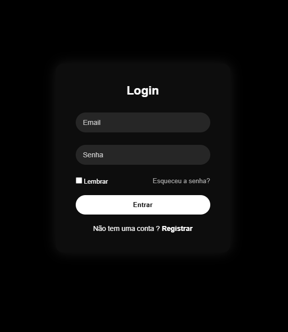

## Painel de Login

Projeto simples de login desenvolvido com HTML, CSS e JavaScript.

## Funcionalidades

- Login com validação de email e senha
- Sistema de registro de usuário
- Limite de tentativas de login
- Bloqueio após múltiplas tentativas
- Opção "lembrar senha" utilizando localStorage
- Mensagens de feedback para o usuário

## Tecnologias

- HTML
- CSS
- JavaScript

## Objetivo

Projeto criado para praticar lógica de programação e manipulação de DOM.

## Próximos passos

- Integração com um dashboard
- Melhorias na interface
- Validações mais robustas

## Preview

